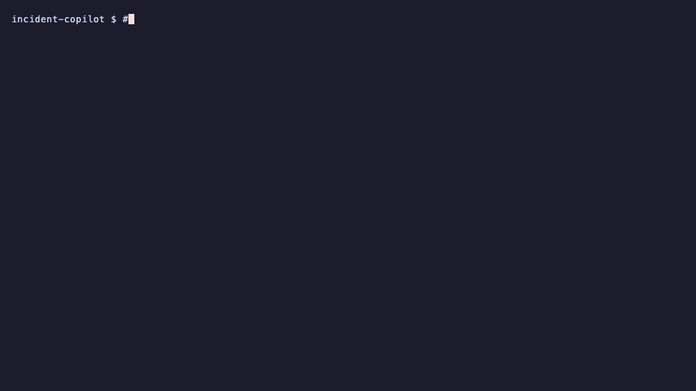

# Incident Copilot

A 100% local observability stack with an AI incident-triage agent — runs
entirely on your machine, no cloud and no paid APIs.



## Architecture

Four FastAPI services with cascading dependencies export Prometheus metrics.
A self-driving load generator produces continuous traffic. Prometheus scrapes
the services; Grafana visualises request rate, error ratio and p95 latency.
Runtime chaos injection lets you create real incidents. A local LLM agent then
reads the metrics and triages the incident.

```
loadgen -> checkout -> payments
        -> orders   -> inventory
                 |
           /metrics -> Prometheus -> Grafana
                            |
                     triage agent (Ollama + LangGraph)
```

## Run

    docker compose up -d --build

- Grafana:    http://localhost:3001  (anonymous, local only)
- Prometheus: http://localhost:9090/targets
- Services:   http://localhost:8001..8004

## Inject an incident

    # 50% failures on payments -> checkout errors cascade
    curl -X POST "http://localhost:8002/chaos?failure_rate=0.5"
    # +600ms latency on inventory -> orders p95 climbs
    curl -X POST "http://localhost:8004/chaos?latency_ms=600"
    # reset
    curl -X POST "http://localhost:8002/chaos?failure_rate=0"

## AI triage

A local agent (Ollama + LangGraph) reads live Prometheus metrics through tools
and produces a full incident report — no cloud, no API keys. It scores severity,
traces the root cause across the service dependency graph, drills down to the
failing endpoint, compares against five minutes ago, and suggests a remediation.
Full details in `agent/`.

    uv venv && source .venv/bin/activate
    uv pip install -r agent/requirements.txt
    # break one endpoint, then triage
    curl -X POST "http://localhost:8002/chaos?endpoint=charge&failure_rate=0.6"
    python -m agent.triage

Example output:

    SEVERITY: SEV1 — peak error ratio 0.25 across affected services.
    SUMMARY: payments is failing, causing errors in checkout.
    AFFECTED: checkout (error_ratio 0.25, p95 0.28s),
              payments (error_ratio 0.14, p95 0.22s).
    ROOT CAUSE: payments, /charge endpoint — errors.
    WHAT CHANGED: payments error ratio rose from 0.00 to 0.14 in the last 5 min.
    REMEDIATION: inspect /charge's recent deploy/config and logs; consider a
                 rollback or restart; verify its dependencies.

## Stack

FastAPI · Prometheus · Grafana · Docker Compose · Ollama · LangGraph

Configurable model via `OLLAMA_MODEL` (default `llama3.2`).
